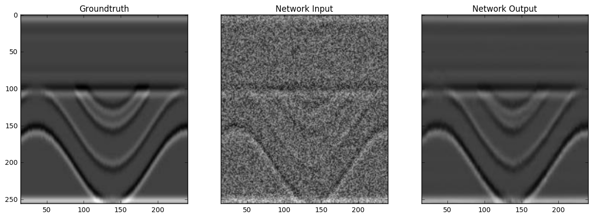
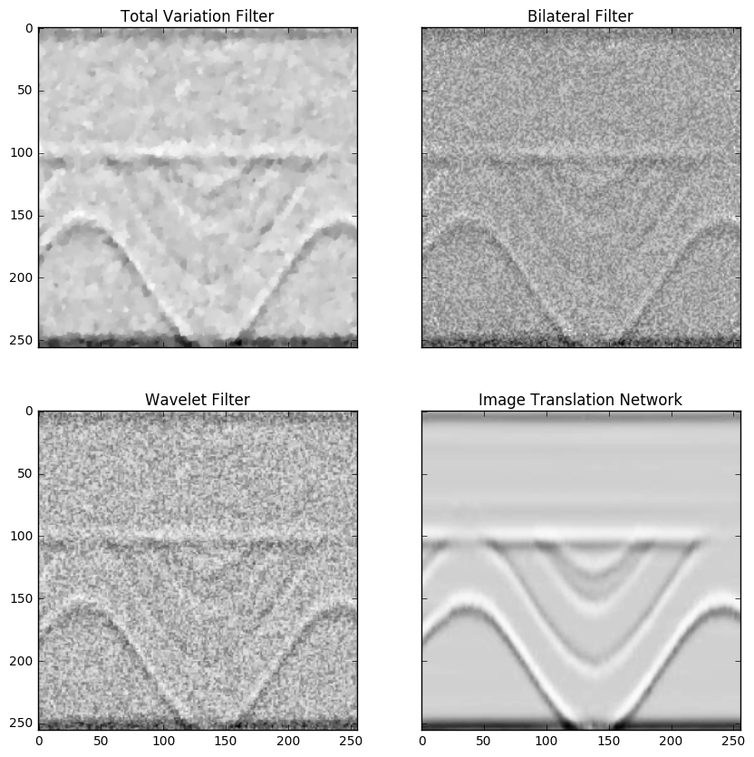

# CSEG Image Translation

Welcome to the repo for [Graham Ganssle's](https://gra.m-gan.sl) article, *Denoising Seismic by Image Translation Networks*, in the CSEG Recorder, January 2018 edition! If you have any questions, please send Graham a message.

## Results
It works!

*The above image is an example output from the denoising network.*

*The above image is a comparison of the denoising network with three common denoising filters: total variation, bilateral, and wavelet.*

## Setup
To run this code you'll need [Torch7](http://torch.ch/) running on CUDA, and CuDNN. You'll also need [Agile's](https://agilescientific.com/) bruges, which can be installed simply with `pip install bruges`.

## Running this code
I've included the `prep_images.sh` script to prep the data for you. To run it use `bash prep_images.sh`. It'll create a folder, `dat/pairs`, which has the subdirectories `test`, `train`, and `val`. These three folders are the ones you should use to train your model.

Training will take a considerable amount of compute. To do a full training run with 200 epochs it took a whole day on an NVIDIA Tesla K80.

## Acknowledgements

The image translation network used in this project was the wonderful [pix2pix](https://github.com/phillipi/pix2pix). Thanks Phillipi! 

Thanks, also, to Steve Purves for building the Earth models provided (in .zip format) in [dat/zips](./dat/zips)! To use these models simply `cd dat/zips/` and `unzip xxx`, where `xxx` is the file name.
